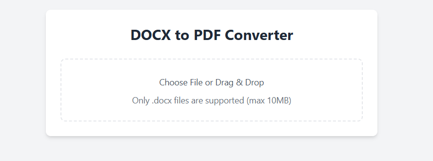
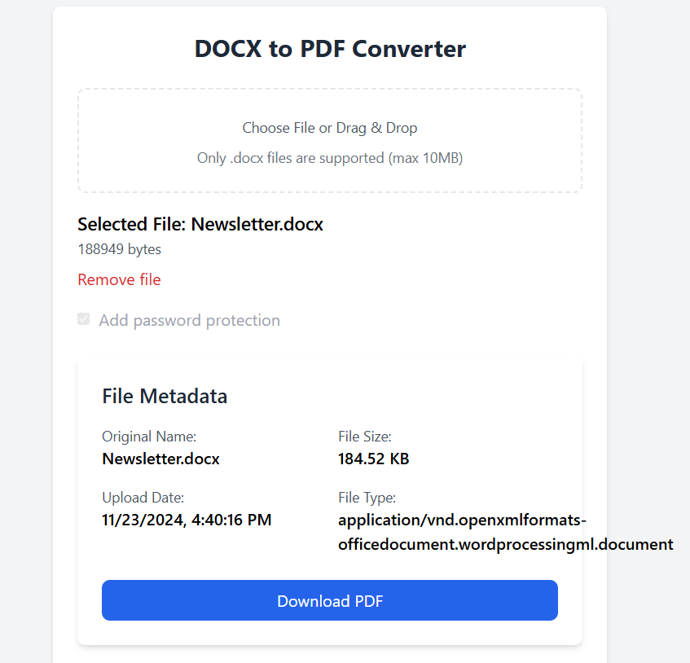

# DOCX to PDF Converter - Technical Documentation

## Table of Contents
1. [Project Overview](#project-overview)
2. [System Architecture](#system-architecture)
3. [Technologies Used](#technologies-used)
4. [Setup Instructions](#setup-instructions)
5. [Docker Configuration](#docker-configuration)
6. [Custom Entrypoint Script](#custom-entrypoint-script)
7. [Environment Variables](#environment-variables)
8. [API Documentation](#api-documentation)
9. [Screenshots and Docker Structure](#screenshots-and-docker-structure)
10. [Development Guidelines](#development-guidelines)
11. [Troubleshooting](#troubleshooting)

---

## Project Overview

The DOCX to PDF Converter is a web-based application that allows users to upload DOCX files and convert them into PDF format. It uses a monolithic architecture encapsulated in a single Docker container running MongoDB, a Node.js backend, and a React frontend.

---

## System Architecture

This project uses a **monolithic** architecture where:
- **Frontend**: A React-based application for user interaction.
- **Backend**: A Node.js application for file processing and serving the frontend.
- **Database**: MongoDB for storing file metadata.


---

## Technologies Used

### Frontend
- React 18
- Vite for fast development builds
- Axios for API communication
- Tailwind CSS for styling

### Backend
- Node.js 18
- Express.js for API handling
- LibreOffice for DOCX to PDF conversion
- QPDF for PDF encryption

### Database
- MongoDB (latest)

### DevOps
- Docker for containerization
- Bash scripting for container orchestration

---

## Setup Instructions

### Prerequisites
- Docker and Docker Compose installed

### Installation Steps
1. Clone the repository:
   ```bash
   git clone [repository-url]
   cd docx-pdf-converter
   ```

2. Build and run the Docker container:
   ```bash
   docker build -t docx-pdf-converter .
   docker run -p 3000:3000 -p 5000:5000 -p 27017:27017 docx-pdf-converter
   ```

3. Access the application:
   - **Frontend**: [http://localhost:3000](http://localhost:3000)
   - **Backend**: [http://localhost:5000](http://localhost:5000)

---

## Docker Configuration

The Docker setup uses a **multi-service monolith** approach where all components run inside a single container. 

### Dockerfile
The provided `Dockerfile`:
1. Installs the required dependencies:
   - Node.js 18 for frontend and backend
   - LibreOffice and qpdf for document conversion.
2. Builds the React frontend and serves it alongside the backend.
3. Uses a custom entrypoint script to orchestrate MongoDB, the frontend, and the backend.

**Diagram Placeholder: Docker Configuration**  
[Insert a diagram illustrating the containerized architecture, including MongoDB, backend, and frontend services within one Docker container.]

### Key Docker Commands
- **Build the image**:
  ```bash
  docker build -t docx-pdf-converter .
  ```
- **Run the container**:
  ```bash
  docker run -p 3000:3000 -p 5000:5000 -p 27017:27017 docx-pdf-converter
  ```

---

## Custom Entrypoint Script

The `docker-entrypoint.sh` orchestrates the MongoDB service, builds the React app, serves it, and starts the Node.js backend.

**Entrypoint Script Details**
- **MongoDB**: Starts the database service.
- **Frontend**: Builds and serves the React app.
- **Backend**: Starts the Node.js backend service.

---

## Environment Variables

### Required Variables
- **Frontend**:
  - `VITE_BACKEND_URL`: URL of the backend service.
- **Backend**:
  - `MONGODB_URI`: Connection string for MongoDB.
  - `PORT`: Port for the backend server (default: 5000).
  - `MAX_FILE_SIZE`: Maximum upload size in MB.
  - `UPLOAD_PATH`: Path for uploaded files.

---

## API Documentation

### Endpoints

#### POST /api/documents/upload
Uploads and converts a DOCX file to PDF format.

---

## Screenshots and Docker Structure

### Working Screenshots
1. **Frontend Home Page**  
     

2. **File Upload Screen**  
     

3. **Conversion Success**  
      

### Docker Architecture Diagram
[Insert a diagram that illustrates the Docker container architecture, including port mappings, services, and volume management.]

---

## Development Guidelines

### Project Structure
```
project-root/
├── frontend/
│   ├── src/
│   │   ├── components/
│   │   ├── api/
│   │   └── App.jsx
│   ├── Dockerfile
│   └── package.json
├── backend/
│   ├── src/
│   │   ├── routes/
│   │   ├── controllers/
│   │   └── server.js
│   ├── Dockerfile
│   └── package.json
├── docker-entrypoint.sh
└── docker-compose.yml
```

### Best Practices
1. Use environment variables for configuration.
2. Implement proper error handling.
3. Follow RESTful API conventions.
4. Use proper CORS configuration.
5. Implement logging for debugging.
6. Use volume mounting for persistent data.
7. Implement proper cleanup for temporary files.

---

## Troubleshooting

### Common Issues and Solutions

1. **MongoDB Connection Issues**
   - Verify MongoDB service is running.
   - Check the `MONGODB_URI` in the backend `.env`.

2. **Frontend Not Loading**
   - Ensure the React app is built correctly.
   - Check if `VITE_BACKEND_URL` points to the backend service.

3. **File Upload Errors**
   - Verify the `UPLOAD_PATH` has correct permissions.
   - Check backend logs for errors during conversion.

---

This structure accommodates screenshots for both **working functionalities** and **Docker architecture**. Replace placeholders with actual screenshots and diagrams.
